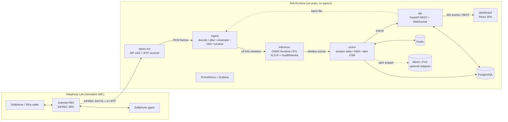
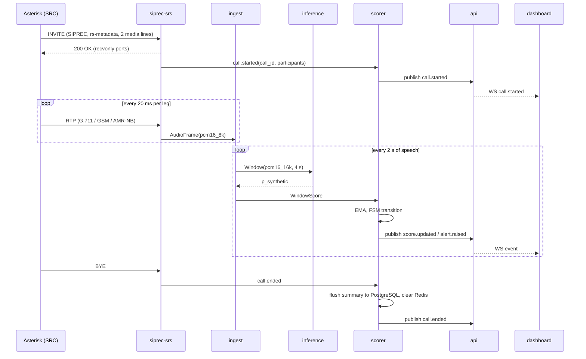
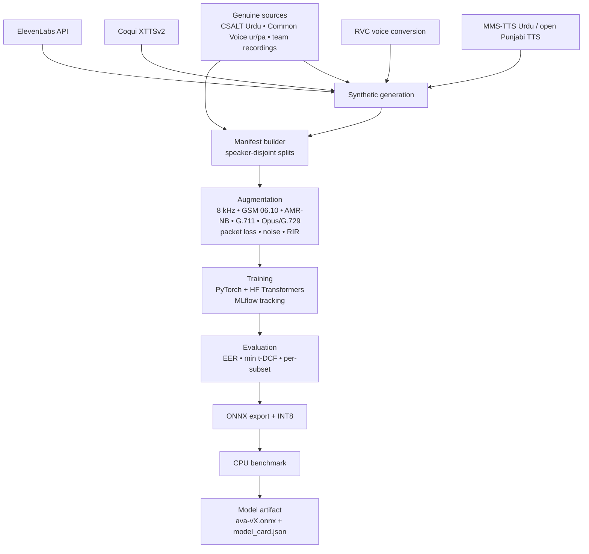

# AVA: Acoustic Veracity Analyzer — System Architecture

| Field | Value |
|---|---|
| Version | 0.1 (draft) |
| Date | 2026-09-04 |
| Companion | [prd.md](prd.md) |
| Status | Draft for supervisor review |

---

## 1. Architecture Overview

AVA is a passive, on-premises detection system with three planes:

1. **Training plane** (offline, run by the team): dataset assembly, synthesis, augmentation, model training, evaluation, ONNX export. Produces versioned model artifacts.
2. **Runtime plane** (deployed at the operator's edge): SIPREC ingestion, streaming inference, session scoring, API, dashboard, storage. Zero external network egress.
3. **Telephony lab** (simulated SBC): Asterisk PBX plus softphones and a call generator, used for integration testing and the SDP demo.



**Design principles**

- **Passive tap.** AVA only ever receives forked media. It never sits in the signaling or media path, so its failure cannot affect a call.
- **Data minimization.** Audio lives in memory as short windows and is discarded after scoring. Persistence is scores, metadata, and optional bounded snippets.
- **Egress-free by construction.** No component needs internet access at runtime. Enforced by Kubernetes NetworkPolicy and verified by test.
- **CPU-first inference.** The model is quantized and truncated to fit a real-time factor of 0.5 on a commodity 8-core server.
- **Boring, replaceable parts.** Every service has a narrow contract so any one can be swapped (e.g. the head, the ingestion path, the PBX).

---

## 2. Runtime Components

### 2.1 `siprec-srs` — SIPREC Recording Server

**Responsibility.** Act as a SIPREC Session Recording Server (RFC 7865 metadata, RFC 7866 protocol). Accept INVITE from the PBX with `a=label` SDP lines and `rs-metadata` XML, answer with two receive-only RTP ports, receive RTP for the caller and agent legs, and hand decoded PCM frames to `ingest`. Handle re-INVITE (hold/resume) and BYE.

**Implementation.**
- Python 3.11, `pjsua2` bindings (PJSIP) for SIP UAS, or a minimal hand-rolled SIP UAS over `aiosip`-style asyncio sockets if pjsua2 packaging proves painful. RTP receive via raw UDP sockets with an RTP header parser (small, ~100 lines).
- Payload decoders: G.711 μ/A-law (`audioop` / pure NumPy), GSM 06.10 (`libgsm` via `pygsm` or `ffmpeg` subprocess), AMR-NB (`opencore-amr` via `ffmpeg` pipe).
- Emits `AudioFrame{call_id, leg, ts, pcm16_8k}` to `ingest` over an in-process asyncio queue (same pod) or Redis Streams (separate pods).

**Fallback path (FR-T3).** Asterisk ARI `ExternalMedia` channel: Asterisk sends plain RTP (`ulaw` or `slin16`) to a configured host:port for a snoop channel. The same RTP receiver code handles it; only the SIP negotiation is bypassed. This is the safety net if native SIPREC in the chosen Asterisk version is unreliable.

### 2.2 `ingest` — Audio Conditioning

**Responsibility.** Turn a per-leg stream of 8 kHz frames into scoring-ready windows.

Pipeline per call leg:
1. **Jitter buffer.** 60 ms depth, sequence-number reorder, packet-loss concealment (repeat last 20 ms frame, then zero-fill after 3 consecutive losses).
2. **Resample 8 kHz → 16 kHz.** `soxr` (via `soxr` Python bindings) with a high-quality band-limited filter. Note: this adds no information above 4 kHz; the model is trained on identically upsampled audio so the domain matches.
3. **VAD.** Silero VAD (ONNX, CPU, ~1 ms per 30 ms frame). Frames below speech probability 0.5 are excluded from window accumulation but still advance time.
4. **Windowing.** Ring buffer of speech audio; emit a 4 s window every 2 s of accumulated speech (`WINDOW_S`, `HOP_S` configurable). Also emit at leg end if ≥ 1.5 s remains.
5. **Normalization.** Peak-normalize to −3 dBFS; the same op is applied in training.

Output: `Window{call_id, leg, window_idx, t_start, t_end, pcm16_16k[64000]}`.

Batch mode reuses this module with a file source instead of RTP (decode with `ffmpeg`, then steps 2–5).

### 2.3 `inference` — Model Serving

**Responsibility.** Score windows with the exported ONNX model.

- ONNX Runtime 1.18+ CPU execution provider, INT8 dynamic-quantized graph.
- Per worker: `intra_op_num_threads=4`, `inter_op_num_threads=1`; workers = physical cores / 4 (2 workers on the reference box, each handling ~4 calls).
- **Micro-batching.** Windows arriving within a 100 ms collection interval are batched (max batch 4) to raise CPU throughput without hurting latency.
- **Model contract.** Input: `float32[B, 64000]` at 16 kHz. Output: `logits[B, 2]`, `embedding[B, 256]` (kept for future analyst tooling). Post-processing applies calibrated temperature and returns `p_synthetic`.
- Model files loaded from `/models/ava-<version>.onnx` on a read-only volume. A `model_card.json` alongside declares version, window size, sample rate, and calibration temperature; `inference` refuses to start if the card and config disagree.
- Exposes an internal gRPC or plain HTTP `/score` (HTTP chosen for simplicity, see ADR-9); `scorer` calls it, or in the single-pod deployment it is an in-process call.

### 2.4 `scorer` — Session State and Alert Logic

**Responsibility.** Maintain per-call state and decide when to alert.

- Per call leg: EMA of `p_synthetic` with α = 0.4, count of scored windows, max score, recent scores ring (last 30).
- **Minimum evidence.** No verdict until ≥ 2 windows scored (≈ 6 s of speech at hop 2 s).
- **Alert state machine (hysteresis).**
  - `monitoring → suspicious` when EMA ≥ 0.60
  - `suspicious → alert` when EMA ≥ 0.75 for 2 consecutive windows
  - `alert → suspicious` when EMA < 0.55
  - `suspicious → monitoring` when EMA < 0.40
  - Thresholds live in config and are the admin-tunable operating point.
- On entering `alert`: persist alert row, publish `alert.raised`, optionally capture the last 30 s of the leg's windows into the snippet store (if retention enabled).
- State is held in Redis (hash per call) so `scorer` can restart without losing sessions; call summaries are flushed to PostgreSQL on `call.ended`.
- Publishes events to a Redis pub/sub channel consumed by `api`.

### 2.5 `api` — FastAPI Service

**Responsibility.** External contract for the dashboard, batch analysis, and operators.

- FastAPI + Uvicorn, Pydantic v2 models, OpenAPI at `/docs`.
- REST endpoints per PRD §5.5; WebSocket `/v1/events` fans out Redis pub/sub events to connected clients with optional call-ID filter.
- Auth: session cookie (httponly) after username/password login; passwords hashed with Argon2; two roles. Local users table only, no external IdP (P2: OIDC to an on-prem IdP).
- Batch: file is written to a temp dir, pushed through `ingest` (file source) and `inference`, results returned synchronously for ≤ 60 s files and as a job (`202` + poll) for longer.
- Audit middleware writes every mutating request to `audit_log`.

### 2.6 `dashboard` — React SPA

- React 18 + TypeScript + Vite, served as static files by the `api` container (Uvicorn `StaticFiles`) so there is one origin and no CORS.
- State: TanStack Query for REST, a small WebSocket hook for live events.
- Charts: lightweight SVG sparklines (no heavy chart library) for per-call score trends.
- All fonts and assets bundled; no CDN references (FR-U8).

### 2.7 Storage

| Store | Purpose | Retention |
|---|---|---|
| **PostgreSQL 16** | `calls`, `call_legs`, `alerts`, `alert_feedback`, `users`, `audit_log`, `batch_jobs`, `settings` | Indefinite (metadata only) |
| **Redis 7** | Live session state, event pub/sub, micro-batch queues | Ephemeral |
| **MinIO** (or plain PVC directory) | Optional alert snippets (≤ 30 s WAV, encrypted at rest) and batch uploads (deleted after processing) | TTL, default 7 days, default OFF |

### 2.8 Observability

- Prometheus metrics from every service: stage latencies (histograms), active calls, queue depth, inference batch size, alerts/min, dropped windows (degraded mode).
- Grafana with a provisioned dashboard. Structured JSON logs to stdout collected by the cluster (Loki optional).

---

## 3. Data Flow: Live Call



**Latency budget per hop (reference box, target p95):**

| Stage | Budget |
|---|---|
| RTP arrival → frame available | 60 ms (jitter buffer) |
| Resample + VAD + windowing | 20 ms |
| Micro-batch wait | ≤ 100 ms |
| ONNX inference (4 s window, INT8, 4 threads) | ≤ 1,200 ms |
| Scorer + publish | 10 ms |
| WS to browser render | ≤ 200 ms |
| **Total, window end → UI** | **≤ 1.6 s** |

With hop 2 s and inference ≤ 1.2 s, the real-time factor is 0.3 per call at one call per worker-thread-group; the micro-batcher raises capacity to the 8-call target.

---

## 4. Model Architecture

### 4.1 Backbone: XLS-R

- Start from `facebook/wav2vec2-xls-r-300m` (24 transformer layers, 1024-d, pretrained on 436k hours across 128 languages, including Urdu and Punjabi).
- **Layer truncation.** Keep the CNN feature encoder plus the first 12 transformer layers. Prior anti-spoofing work consistently finds spoof-discriminative information concentrated in lower/middle layers; truncation halves CPU cost and memory. The exact cut is chosen by a layer-sweep experiment in Phase 2.
- **Learnable layer weighting.** A softmax-weighted sum over the kept layers' hidden states (SUPERB-style) feeds the head. This lets the model pick artifact-rich layers without hand-tuning.
- Fine-tune with a small backbone LR (2e-5) and a larger head LR (1e-3), with the CNN feature encoder frozen for the first epochs.

### 4.2 Head: Dual-Column Bidirectional Mamba (DuaBiMamba)

- Input: `[T, 1024]` weighted hidden states (T ≈ 199 for 4 s at 20 ms stride). Project to 256-d.
- Two parallel columns of stacked bidirectional Mamba blocks (2 blocks each), each processing the sequence forward and backward with separate SSM parameters; columns differ in state dimension (16 and 64) to capture short- and long-range artifact patterns. Column outputs are concatenated and fused by a linear layer.
- Attentive statistics pooling (mean + std with learned attention) → 256-d embedding → 2-class linear output.
- Loss: weighted cross-entropy (or OC-Softmax as an ablation). Training-time augmentation: RawBoost-style linear/nonlinear distortion plus the codec chain from §5.

**Why Mamba on CPU works here.** T ≈ 200 is short; a sequential selective scan in pure PyTorch/ONNX over 200 steps with d_state ≤ 64 is a few million FLOPs, negligible next to the backbone. The CUDA-fused kernel is only needed for training speed.

### 4.3 Export and Quantization

1. Replace the `mamba_ssm` fused scan with a reference sequential-scan module (numerically identical) for tracing.
2. `torch.onnx.export` with opset 17, dynamic batch axis; fixed T (64000 samples) to keep the graph static.
3. Validate parity on 100 dev windows (max |Δlogit| < 1e-3).
4. ONNX Runtime dynamic INT8 quantization of MatMul/Linear ops; re-measure EER on dev (accept ≤ 0.3 point degradation).
5. Optional: `onnxruntime` graph optimization level `ORT_ENABLE_ALL`, save optimized graph.
6. Benchmark on the reference box; record in `model_card.json`.

### 4.4 Baselines

AASIST and RawNet2 trained from their public reference implementations on the same manifests, same augmentation, same speaker-disjoint splits. Reported side-by-side with AVA.

---

## 5. Training Plane



**Augmentation implementation.** `ffmpeg` (with `libgsm`, `libopencore-amrnb`, `libopus`) driven by a Python job runner; each utterance gets a randomly sampled codec chain recorded in the manifest so per-codec EER can be computed. Noise and RIR via `audiomentations`. Packet loss simulated by dropping 20 ms frames before decoding.

**Splits.** Speaker-disjoint 70/10/20. One generator held out entirely from train/dev (rotated across experiments; final report uses the strongest generator, likely ElevenLabs, as the unseen attack).

**Compute.** Training on a lab GPU if available; otherwise a rented GPU VM. Only synthetic audio and team-consented recordings may leave the premises; licensed third-party corpora stay on team-controlled machines unless their license permits otherwise.

---

## 6. Telephony Lab

- **Asterisk 20 LTS** (or 21) in a container, PJSIP stack. Configured with two internal extensions (caller, agent) and a recording profile that forks media to `siprec-srs`. If native SIPREC SRC is not available in the chosen build, the dialplan uses a `Snoop` + `ExternalMedia` ARI application to fork RTP (FR-T3).
- **Endpoints.** Linphone/Zoiper softphones for manual demo; **SIPp** scenarios with `-rtp_echo`/PCAP playback for automated tests that inject known genuine and synthetic WAVs.
- **Codec forcing.** Endpoints configured to negotiate `gsm`, `amr` (if module present), or `ulaw` so each codec path can be exercised deliberately.
- **E2E test.** CI job: bring up Asterisk + AVA via compose, SIPp plays a synthetic Urdu file, assert an `alert.raised` event within 15 s; then plays a genuine file, assert no alert.

---

## 7. Deployment

### 7.1 Containers

| Image | Base | Notes |
|---|---|---|
| `ava/siprec-srs` | `python:3.11-slim` + pjsip + ffmpeg | UDP ports for SIP (5060) and RTP range |
| `ava/ingest-inference` | `python:3.11-slim` + onnxruntime + soxr | Single image running ingest + inference + scorer in one process for the single-node demo; split into separate Deployments when scaling |
| `ava/api` | `python:3.11-slim` | Serves dashboard static build too |
| `postgres:16`, `redis:7`, `minio`, `prom/prometheus`, `grafana/grafana` | upstream, digest-pinned | |
| `ava/asterisk-lab` | `debian:bookworm` + asterisk | Lab only, not part of production manifests |

### 7.2 Kubernetes (k3s single node for the demo)

- Namespace `ava`. Deployments for each service; StatefulSet for PostgreSQL; PVCs for models, DB, and optional snippets.
- `NetworkPolicy`: default deny egress; allow pod-to-pod within namespace, allow `siprec-srs` ingress from the PBX subnet only, allow `api` ingress from the analyst LAN via Ingress (Traefik, bundled with k3s) with TLS from an internal CA.
- Resource requests/limits sized to the reference box: `ingest-inference` requests 6 CPU / 6 GiB, limit 8 CPU / 8 GiB.
- Readiness probe on `inference` performs a warm-up inference so the first real window is not slow.
- `docker compose` mirrors this for developer laptops.

### 7.3 Configuration

Single `ava.yaml` mounted as a ConfigMap, validated by Pydantic at startup:

```yaml
audio:
  window_s: 4.0
  hop_s: 2.0
  vad_threshold: 0.5
scoring:
  ema_alpha: 0.4
  min_windows: 2
  thresholds: { suspicious_enter: 0.60, alert_enter: 0.75, alert_exit: 0.55, suspicious_exit: 0.40 }
  score_legs: [caller]
retention:
  snippets_enabled: false
  snippet_ttl_days: 7
inference:
  model_path: /models/ava-v1.onnx
  intra_threads: 4
  max_batch: 4
  batch_wait_ms: 100
```

---

## 8. Security and Compliance Controls

| Control | Implementation | Verifies |
|---|---|---|
| No egress | NetworkPolicy default-deny + CI test that runs the stack with all outbound DNS/HTTP blocked | CTDISR-2025 localization |
| No model download at runtime | Models on PVC; images contain no HF token; startup fails loudly if model missing | CTDISR-2025 |
| Audio minimization | Windows are `bytearray`s freed after scoring; snippet retention off by default, bounded and TTL'd | PDPB 2023 |
| Encryption in transit | TLS on `api` ingress; SIP-TLS/SRTP documented as P2 for production | Both |
| Encryption at rest | Snippets AES-256-GCM with a key from Kubernetes Secret; DB volume encryption is host-level | PDPB 2023 |
| Access control | Argon2 passwords, httponly session cookie, `analyst`/`admin` roles | PDPB 2023 |
| Auditability | `audit_log` table for logins, setting changes, feedback, exports | PDPB 2023 |
| Supply chain | Images digest-pinned; `pip` requirements hashed; SBOM generated in CI | General |
| Passive tap | AVA never sends RTP or SIP re-INVITEs to the PBX beyond SIPREC answers | CTDISR-2025 infrastructure safety |

---

## 9. Repository Layout

```
FYP/
├── prd.md
├── architecture.md
├── data/                     # manifests + scripts only; audio lives on a data volume
│   ├── collect/              # source downloaders, consent-form templates
│   ├── synth/                # elevenlabs.py, xtts.py, rvc.py, mms_tts.py
│   ├── augment/              # codec_chain.py, noise.py, manifest.py
│   └── datasheet.md
├── model/
│   ├── ava/                  # backbone.py, duabimamba.py, pooling.py, model.py
│   ├── baselines/            # aasist/, rawnet2/
│   ├── train.py  eval.py  export_onnx.py  quantize.py  benchmark_cpu.py
│   └── configs/
├── services/
│   ├── siprec_srs/
│   ├── ingest/
│   ├── inference/
│   ├── scorer/
│   └── api/
├── dashboard/                # React + Vite
├── lab/
│   ├── asterisk/             # pjsip.conf, extensions.conf, ari app
│   └── sipp/                 # scenarios + test audio
├── deploy/
│   ├── docker/               # Dockerfiles
│   ├── compose.yaml
│   └── k8s/                  # manifests, networkpolicy, ingress
├── tests/                    # unit, integration, e2e
└── docs/                     # deployment guide, compliance checklist, model card
```

---

## 10. Architecture Decision Records

### 10.0 The short version

One plain sentence per choice. The detailed records with alternatives follow.

| Choice | Why, in plain words |
|---|---|
| **XLS-R backbone** | It is the only big speech model that has already heard lots of Urdu and Punjabi, so it does not mistake normal Urdu sounds for fakery. |
| **Cut it to 12 layers** | The bottom half of the model is where fake-detection clues live. Dropping the top half halves the cost with little accuracy loss. |
| **Mamba head** | Fakes show up as patterns over time, not in single frames. Mamba reads the sequence in order, cheaply, in both directions. |
| **CPU only, ONNX, INT8** | Call centers own ordinary servers, not GPUs. ONNX Runtime is the fastest way to run a model on a CPU, and INT8 makes it 2 to 3 times faster again. |
| **4 s windows every 2 s** | 4 s is enough audio to judge; 2 s is often enough to feel live. Waiting for two windows avoids false alarms in the first "hello". |
| **Smoothing + hysteresis** | One noisy window should not flip an alert on and off. Average the scores and use different on and off thresholds. |
| **Fixed list of fake generators** | You cannot test "diverse". You can test "1,500 clips each from ElevenLabs, XTTSv2, RVC, MMS-TTS". |
| **Hold one generator out** | If we test only on tools we trained on, we are grading ourselves on memorized fingerprints. Fraudsters use tools we have not seen. |
| **Speaker-disjoint splits** | Otherwise the model can cheat by learning "this voice is always fake" instead of learning what fake sounds like. |
| **SIPREC + Asterisk** | SIPREC is the standard way phone systems already fork audio to recorders. Speak it and any real operator can plug us in. Asterisk is the free PBX we can run in a lab. |
| **Passive, never in the call path** | If we sat in the middle and crashed, calls would drop. Nobody deploys that. We only listen to a copy. |
| **FastAPI + WebSocket** | The ML code is Python; keep the API in Python too so batch and live share one code path. WebSocket lets the dashboard receive live updates. |
| **React dashboard, served by the API** | The live board changes every 2 s; React is built for that. Serving it from the same container means one box, one URL, no cross-origin headaches. |
| **PostgreSQL + Redis** | PostgreSQL stores permanent records everybody knows how to back up. Redis holds the fast-changing "what is happening on this call right now" state. |
| **Kubernetes (k3s) + NetworkPolicy** | The scope promises Kubernetes, and NetworkPolicy is how we *prove* the system cannot phone home, rather than just saying so. |
| **No audio stored by default** | Less stored voice data means less to protect and less to explain to a regulator. Snippets are opt-in and auto-delete. |
| **Silero VAD + soxr** | Do not waste CPU scoring silence or hold music. Resample exactly the same way in training and in production so the model sees the same thing. |
| **Python everywhere** | The slow part is already native code inside ONNX Runtime. One language means all four team members can work on any part. |

Each record below states the decision, the alternatives that were seriously considered, and why they lost.

### ADR-1: XLS-R as the backbone

**Decision.** Fine-tune XLS-R 300M, layer-truncated.

**Alternatives.** (a) WavLM Large; (b) wav2vec 2.0 base (English); (c) raw-waveform end-to-end models (RawNet2/AASIST) with no SSL front-end; (d) hand-crafted features (LFCC/CQCC) + light CNN.

**Reasoning.**
- The central failure mode in the scope is *linguistic mismatch*. XLS-R is the only widely available SSL model whose pretraining explicitly includes Urdu and Punjabi speech, so its representations already model South Asian phonetics rather than treating them as anomalies. WavLM Large is strong on English benchmarks but is English-dominated in pretraining.
- SSL front-ends + small heads are the current state of the art on ASVspoof 2021 DF and In-the-Wild, with large margins over raw-waveform models, especially under codec compression and unseen attacks. Raw-waveform models are kept as the required baselines rather than the product.
- LFCC/CQCC pipelines are cheap on CPU but depend on the high-frequency structure that GSM/AMR-NB destroys (the scope's second failure mode). SSL features degrade more gracefully at 8 kHz effective bandwidth.
- Cost: 300M parameters is heavy on CPU, which is why truncation, INT8, and the fallback to a smaller backbone (PRD A3, R1) are built in from the start rather than discovered late.

### ADR-2: DuaBiMamba as the classification head

**Decision.** Dual-column bidirectional Mamba with attentive statistics pooling.

**Alternatives.** (a) Mean-pool + MLP; (b) BiLSTM/BiGRU; (c) small Transformer encoder; (d) AASIST-style graph attention on SSL features.

**Reasoning.**
- Synthesis artifacts are temporal: vocoder periodicity errors, unnatural prosody transitions, and code-switch boundary discontinuities unfold over hundreds of milliseconds. Mean pooling discards that ordering; sequence models keep it.
- Mamba's selective state-space scan is linear in sequence length and has a small parameter count, which keeps CPU cost low relative to a Transformer's quadratic attention, and it has shown strong results on recent anti-spoofing work (bidirectional/dual-column Mamba heads on SSL features report state-of-the-art EER on ASVspoof 2021 and In-the-Wild).
- Bidirectionality matters because artifacts at a frame are explained by both preceding and following context; two columns with different state sizes cheaply cover short- and long-range dependencies.
- BiGRU is the designated fallback (R2) because it exports to ONNX trivially and is within a point or two of Mamba in published comparisons. The MLP head is retained as the ablation to show the head earns its cost (FR-M8).

### ADR-3: CPU-only inference with ONNX Runtime and INT8

**Decision.** ONNX Runtime CPU execution provider, dynamic INT8 quantization, layer-truncated backbone, micro-batching.

**Alternatives.** (a) PyTorch eager on CPU; (b) TorchScript; (c) OpenVINO; (d) require a GPU.

**Reasoning.**
- Requiring a GPU was rejected by the user decision D3: real call center edge boxes are commodity servers, and a CPU-only design is the honest test of "edge deployable". It also removes CUDA driver coupling from the container images, simplifying Kubernetes portability (BO-7).
- ONNX Runtime beats PyTorch eager on CPU by a wide margin for transformer inference thanks to graph fusion and its quantized MatMul kernels, and it is the format named in the scope (BO-3). TorchScript offers less optimization and is being deprecated in favor of `torch.export`.
- OpenVINO is faster still on Intel CPUs but ties the deployment to Intel hardware and adds a second export toolchain. It is a possible P2 optimization behind the same `/score` contract, not the default.
- INT8 dynamic quantization needs no calibration dataset, typically gives 2–3× speedup on Linear-heavy graphs, and costs well under 0.5 EER points in practice; static quantization is available if the dev-set check fails.
- Micro-batching turns 8 independent calls into 2 batched inferences per hop, which is how the concurrency target is met without more cores.

### ADR-4: SIPREC as the integration protocol, Asterisk as the proxy SBC

**Decision.** AVA implements a SIPREC SRS; the lab uses Asterisk as the SRC.

**Alternatives.** (a) Port mirroring / packet capture (SPAN) with RTP reconstruction; (b) proprietary PBX recording APIs; (c) FreeSWITCH or Kamailio as the lab PBX; (d) build AVA as a SIP B2BUA in the media path.

**Reasoning.**
- SIPREC is the vendor-neutral standard every real SBC (Oracle, Ribbon, AudioCodes) already speaks for compliance recording. Speaking SIPREC means a real operator can point an existing recording profile at AVA with no custom integration, which is the product's actual go-to-market path (Vision, §5 of the scope).
- Packet capture avoids PBX configuration but is brittle (needs switch access, call correlation from SIP sniffing) and looks like surveillance infrastructure to a compliance officer. SIPREC carries explicit call metadata and is a sanctioned, auditable feature.
- Being in the media path (B2BUA) would let AVA block calls, but it also means AVA failure drops calls, which violates FR-T5 and would make no operator deploy it. Passive is the only acceptable posture for a first product.
- Asterisk was chosen for the lab because it is free, well documented, containerizes easily, supports PJSIP, and has the ARI `ExternalMedia` escape hatch if its SIPREC client support is lacking. FreeSWITCH is a fine alternative and the SRS is PBX-agnostic; Kamailio is a proxy, not a media-handling PBX, so it cannot fork media alone.

### ADR-5: FastAPI + WebSocket for the API layer

**Decision.** FastAPI (Python) with REST for control and WebSocket for live events.

**Alternatives.** (a) gRPC streaming service; (b) Django REST Framework; (c) Node.js/Express; (d) Server-Sent Events instead of WebSocket.

**Reasoning.**
- The whole ML and audio stack is Python (PyTorch, ONNX Runtime, soxr, Silero VAD). Keeping the API in Python lets batch mode call the same `ingest` and `inference` code in-process, with no serialization boundary and no second language for a four-person student team to maintain.
- FastAPI is async-native (needed for WebSocket fan-out and for awaiting inference without blocking), generates OpenAPI automatically (FR-A9), and validates payloads with Pydantic, which also validates config. Django is heavier and synchronous by default; its ORM and admin are not needed.
- gRPC gives lower overhead, but browsers cannot speak it natively (grpc-web needs a proxy), the event volume is tiny (one event per call every 2 s), and REST/WebSocket is far easier for a call center's IT staff to integrate with. gRPC remains an option for the internal `scorer → inference` hop if profiling ever shows HTTP overhead matters (it will not at this scale).
- WebSocket over SSE because the dashboard also sends messages upstream (subscribe/unsubscribe to calls, acknowledge alerts), which SSE cannot do without a second channel.

### ADR-6: React + TypeScript + Vite dashboard, served by the API container

**Decision.** Single-page React app, statically bundled, served from the same origin as the API.

**Alternatives.** (a) Server-rendered Jinja templates in FastAPI; (b) Vue/Svelte; (c) a separate Nginx container; (d) Streamlit/Gradio.

**Reasoning.**
- The live call board is inherently stateful and event-driven (cards updating every 2 s from a WebSocket), which is what a component framework with a reactive model is for. Jinja pages would need hand-rolled DOM updates.
- React was picked over Vue/Svelte purely on team familiarity and hiring familiarity; the choice is not load-bearing and the dashboard is thin.
- Streamlit/Gradio are excellent for demos but cannot deliver role-based auth, WebSocket-driven multi-call boards, or a bundled offline build cleanly; they would have to be replaced before any pilot.
- Serving the static build from the API container removes CORS, one container, and one TLS endpoint from the deployment, which matters for an on-prem installer with limited ops staff. Vite is used only at build time; the runtime has no Node process.

### ADR-7: PostgreSQL + Redis (+ optional MinIO) for storage

**Decision.** PostgreSQL for durable records, Redis for live state and pub/sub, MinIO or a plain volume for optional snippets.

**Alternatives.** (a) SQLite only; (b) MongoDB; (c) Kafka/NATS for events; (d) keep all state in-process.

**Reasoning.**
- Call, alert, feedback, and audit records are relational and queried with filters and joins (FR-A4, FR-U5); PostgreSQL is the boring, correct answer and every ops team knows how to back it up. SQLite would work for the demo but cannot be shared by multiple pods, blocking the split-service deployment.
- Live per-call state must survive a `scorer` restart (§6.5) and be readable by the API for the call board; Redis hashes give that with sub-millisecond access and an expiry. Its pub/sub is enough for the event volume, which is far below what Kafka or NATS justify operationally.
- MongoDB offers nothing here that PostgreSQL's JSONB does not, at the cost of a second query language.
- Snippets are binary blobs with a TTL; an object store (MinIO, S3-compatible, runs on-prem) is the natural fit and keeps large blobs out of PostgreSQL. It is optional because retention is off by default (FR-O6).

### ADR-8: Docker + Kubernetes (k3s) with NetworkPolicy

**Decision.** All services containerized; k3s single-node for the SDP; `docker compose` for dev.

**Alternatives.** (a) Compose only; (b) full upstream Kubernetes/kubeadm; (c) systemd services on a VM; (d) Nomad.

**Reasoning.**
- BO-7 names Docker and Kubernetes explicitly, and the compliance argument (BO-5) leans on `NetworkPolicy` to enforce egress denial declaratively rather than by convention. Compose cannot express that policy; it is kept for developer ergonomics only.
- k3s is a certified Kubernetes distribution that installs in one command on a single machine, bundles Traefik ingress and local-path storage, and runs the same manifests a multi-node cluster would. Full kubeadm adds setup effort with no benefit at demo scale.
- Systemd on a VM is simpler but gives no health-probe restarts, resource isolation, or portable manifests, which are the actual "portability across edge hardware" claims being made.
- Nomad is capable but far less familiar to operators and evaluators.

### ADR-9: Single process for ingest + inference + scorer in the demo topology

**Decision.** Run `ingest`, `inference`, and `scorer` in one container/process for the single-node deployment, with module boundaries that allow splitting later.

**Alternatives.** (a) Microservice per stage from day one; (b) monolith including SRS and API too.

**Reasoning.**
- On one 8-core box, splitting the hot path across pods adds serialization of 128 KB windows and network hops for no capacity gain; the CPU is the bottleneck, not process placement.
- The SRS is kept separate because it holds open UDP sockets and SIP dialogs and must not be restarted when a model is reloaded. The API is separate because it faces users and has a different scaling and security profile.
- Module boundaries (`Window`, `WindowScore`, `/score`) are defined as data contracts now so that a multi-node pilot can move `inference` to its own Deployment with an HTTP call swapped in for the in-process one.

### ADR-10: Fixed synthesis stack (ElevenLabs, XTTSv2, RVC, MMS-TTS)

**Decision.** Name the generators in the requirements and hold one out as an unseen attack.

**Alternatives.** (a) Leave generator choice open; (b) reuse only existing corpora (CSALT, ASVspoof).

**Reasoning.**
- The threat is defined by what fraudsters actually use: ElevenLabs is the commercial default, XTTSv2 is the open-source default with Urdu support, RVC is the dominant real-time voice conversion tool, and MMS-TTS gives a cheap, fully local Urdu generator for volume. Together they cover TTS, zero-shot cloning, and voice conversion, which are acoustically distinct attack families.
- Naming them yields testable acceptance criteria (FR-D2) and a per-generator EER table, instead of a vague "diverse" claim.
- Existing corpora alone fail the scope's own critique: CSALT is clean studio speech, ASVspoof is English. The telephony augmentation on top is what makes the dataset representative.
- Holding out a generator is the only credible way to claim generalization; the model will otherwise learn generator fingerprints (R6).

### ADR-11: 4 s window, 2 s hop, EMA with hysteresis

**Decision.** Score 4 s windows every 2 s; smooth with EMA; alert via a three-state machine with separate enter/exit thresholds.

**Alternatives.** (a) Whole-call scoring at end; (b) 1 s windows for faster alerts; (c) hard threshold on each window.

**Reasoning.**
- Fraud has to be caught during the call to be useful, so end-of-call scoring is out. ASVspoof-style models are typically trained on ~4 s crops; going much shorter hurts EER sharply, going longer delays the first verdict. 4 s/2 s gives a first verdict at ~6 s of speech (FR-I6) with 50% overlap for stability.
- Individual window scores are noisy, particularly around code-switch points and silence edges. EMA suppresses single-window spikes, and hysteresis prevents an alert flapping on and off every 2 s, which analysts would learn to ignore.
- Thresholds are configuration because the right operating point is a business choice (cost of a missed fraud vs. an annoyed analyst) that differs between a bank and a BPO.

### ADR-12: Silero VAD and soxr for conditioning

**Decision.** Silero VAD (ONNX) and `soxr` resampling.

**Alternatives.** WebRTC VAD; energy-based VAD; `librosa`/`scipy` resampling.

**Reasoning.**
- Scoring silence and hold music wastes CPU and produces meaningless scores; a VAD is required. Silero is accurate on noisy telephony audio, language-agnostic, ~1 MB, runs on ONNX Runtime already present in the image, and costs about 1 ms per frame. WebRTC VAD is lighter but noticeably worse on noisy narrowband speech; energy VAD fails on babble noise.
- Resampling must be identical between training and runtime to avoid a domain shift; `soxr` is fast, high quality, and deterministic. `librosa` is slow and pulls in heavy dependencies for a runtime image.

### ADR-13: Python 3.11 across services

**Decision.** Python 3.11 for SRS, ingest, inference, scorer, API, and training.

**Alternatives.** Go or Rust for the SRS/ingest hot path; C++ for inference.

**Reasoning.**
- The hot cost is the ONNX inference, which already runs in native code; Python overhead around it is a few percent. Rewriting the RTP/ingest path in Go would buy little and split the team across languages.
- One language means shared data models (Pydantic), one test framework, one dependency toolchain, and every team member can work on every service.
- 3.11 is chosen for its speed gains over 3.10 and broad wheel availability for onnxruntime, torch, and soxr; 3.12 wheels for some audio libraries were less mature at time of writing.

---

## 11. Risks Specific to the Architecture

| Risk | Mitigation in this design |
|---|---|
| CPU budget missed by XLS-R | Layer sweep in Phase 2, INT8, micro-batching, fallback backbone; benchmark gate before Phase 3 integration. |
| Mamba ONNX export | Reference scan kernel written first; BiGRU head kept in code as a switch. |
| Asterisk SIPREC gaps | ExternalMedia path implemented alongside; SRS code shared. |
| Training/runtime feature mismatch | Single `ingest` module used for both augmentation-time conditioning and runtime; parity test in CI. |
| Redis loss loses live sessions | Acceptable for the demo; Redis AOF persistence enabled; summaries flushed to PostgreSQL at call end. |
| Dashboard scope creep | P0 screens only until BO-1 evidence exists (PRD R8). |
