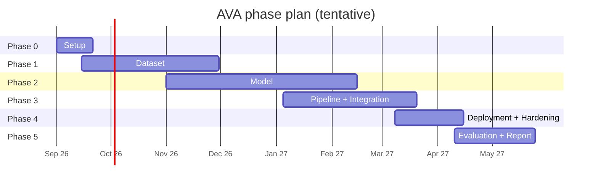
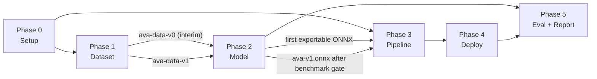

# AVA: Acoustic Veracity Analyzer — Product Requirements Document

Real-time audio deepfake detection for Urdu and Punjabi in telecom and call center pipelines.

| Field | Value |
|---|---|
| Version | 0.1 (draft) |
| Date | 2026-09-04 |
| Source | Project Scope Document v1.0 (GIKI FCSE, BS Software Engineering) |
| Team | Ayesha (2023143), Ibrahim (2023446), Ilsa (2023258), Tughral (2023532) |
| Supervisor | Prof. Dr. Ghulam Abbas |
| Co-Supervisor | Dr. Khurram Khan Jadoon |
| Status | Draft for supervisor review |

---

## 1. Overview

### 1.1 Problem

Pakistan's call center and BPO sector (1,000+ registered centers, $328M+ FY2024-25 export revenue) authenticates callers largely on assumed voice identity. Commodity voice cloning (ElevenLabs, Coqui XTTSv2, RVC) now supports Urdu and Punjabi natively and works from seconds of reference audio, making live telephonic impersonation cheap and practical.

Existing detectors fail here for three reasons:

1. **Linguistic mismatch.** Models trained on English/Western phonetic baselines misread native Urdu/Punjabi phonetics and code-switching as vocoder artifacts, producing high false-positive rates.
2. **Codec blindness.** GSM 06.10 and AMR-NB band-limit audio to under 4 kHz (8 kHz sample rate) and heavily compress it, destroying the high-frequency cues most detectors rely on.
3. **Regulatory non-compliance.** Pindrop, Nuance Gatekeeper, and similar platforms route audio through foreign cloud infrastructure, which CTDISR-2025 prohibits for citizen voice biometrics.

### 1.2 Product

AVA is an on-premises, edge-deployable detection engine that passively monitors forked call audio (SIPREC) and classifies each live call as **genuine** or **AI-synthesized** in near real-time, raising alerts for human fraud analysts without touching the call path. It is trained on a purpose-built corpus of genuine and synthetic Urdu and Punjabi speech degraded with realistic telephony codecs.

### 1.3 Vision

For telecom operators, banks, and BPO call centers in Pakistan handling high-stakes Urdu/Punjabi interactions, AVA is a real-time, edge-deployable B2B audio deepfake detection platform that identifies AI-synthesized speech in live telephonic sessions and generates immediate fraud alerts, without disrupting call traffic and without any foreign cloud dependency.

---

## 2. Goals and Non-Goals

### 2.1 Goals (mapped to scope objectives)

| ID | Goal | Scope ref |
|---|---|---|
| G1 | Minimize Equal Error Rate (EER) on a held-out Urdu/Punjabi telephony test set, benchmarked against AASIST and RawNet2 baselines | BO-1 |
| G2 | Build a representative genuine + synthetic Urdu/Punjabi corpus with telephony codec augmentation | BO-2 |
| G3 | Deliver a near real-time streaming inference pipeline on CPU-only edge hardware via ONNX Runtime | BO-3 |
| G4 | Validate end-to-end in a simulated SIPREC pipeline with Asterisk PBX as proxy Session Border Controller | BO-4 |
| G5 | Architect for CTDISR-2025 and PDPB 2023 compliance: fully on-premises, zero foreign egress | BO-5 |
| G6 | Demonstrate robustness on at least two regional variants: Standard Urdu and Majhi Punjabi | BO-6 |
| G7 | Package as Docker containers orchestrated by Kubernetes for portability across local edge hardware | BO-7 |
| G8 | Provide an analyst-facing dashboard with live verdicts and alerts, plus a batch upload mode for offline analysis | Decision D1, D2 |

### 2.2 Non-Goals (explicitly out of scope)

- Video, multimodal, or text deepfake detection.
- Manipulation localization (splice timestamps) or generator attribution (which tool made it).
- Integration into live, production telecom networks (e.g. PTCL's active infrastructure).
- Detection for English or languages other than Standard Urdu and Majhi Punjabi.
- Speaker identification or biometric voice authentication. AVA detects synthesis artifacts, not identity.
- Replay attack detection (physical-access spoofing) as a primary objective; it may be included in evaluation if time permits.
- Automatic call termination or any active intervention in the call path. AVA is passive and advisory.

---

## 3. Users and Stakeholders

### 3.1 Personas

| Persona | Description | Primary needs |
|---|---|---|
| **Fraud analyst** (primary end user) | Works in a call center or telecom security operations team. Monitors multiple concurrent calls. | Clear real-time alerts, low false positives, enough context to act (call ID, agent, confidence trend, audio snippet). |
| **Security operations lead** | Owns fraud KPIs and tooling. Configures thresholds and reviews history. | Tunable sensitivity, audit logs, exportable reports, integration hooks. |
| **Telecom / PBX engineer** | Deploys and maintains the system on-prem. | Simple container deployment, SIPREC configuration guidance, health metrics, no internet dependency. |
| **Compliance officer** | Ensures PTA / PDPB adherence. | Proof of data locality, retention controls, access logs. |
| **ML engineer** (project team) | Trains, evaluates, and exports models. | Reproducible data pipeline, evaluation harness, export tooling. |

### 3.2 Stakeholders

| Role | Stakeholder |
|---|---|
| Sponsor | GIKI |
| Developers | Ayesha, Ibrahim, Ilsa, Tughral |
| Supervisor / Co-supervisor | Prof. Dr. Ghulam Abbas / Dr. Khurram Khan Jadoon |
| Evaluation | SDP Assessment Committee, FCSE |
| Prospective industry partner | PTCL or equivalent (subject to MOU) |
| Regulators (context only) | PTA, NCCIA |
| Data partners | LUMS CSALT Lab (Urdu), Mozilla Common Voice |

---

## 4. Key Decisions and Assumptions

These were settled during PRD drafting and constrain the architecture.

| ID | Decision | Rationale |
|---|---|---|
| D1 | **Serving:** Python FastAPI service wrapping ONNX Runtime; REST for control/batch, WebSocket for live events; React dashboard for analysts. | Fast to build, easy to containerize, Python-native ML tooling. |
| D2 | **Batch mode is in scope** alongside live SIPREC streaming. | Cheap to add, essential for demos and evaluation, lets analysts re-check recordings. |
| D3 | **Edge target is CPU-only.** No GPU assumed at inference time. Training may use GPUs (lab or rented, with no citizen data leaving country). | Reflects realistic call center hardware; forces a disciplined latency budget. |
| D4 | **Synthesis stack is fixed:** ElevenLabs (API), Coqui XTTSv2, RVC voice conversion, and at least one open TTS (Meta MMS-TTS Urdu; a Punjabi open TTS if available, otherwise XTTSv2 cross-lingual). | Gives concrete acceptance criteria and generator diversity. |
| A1 | Reference CPU box for all latency/throughput targets: **8 physical cores (16 threads), 32 GB RAM, x86-64 with AVX2/AVX-512**. | Typical of a mid-range on-prem server or workstation. |
| A2 | Telephony audio arrives at **8 kHz, mono**, in G.711 (μ-law/A-law), GSM 06.10, or AMR-NB. AVA upsamples to 16 kHz for the backbone. | Matches Pakistani network codecs stated in scope. |
| A3 | XLS-R 300M is the default backbone. If it cannot meet the CPU budget after INT8 quantization and layer pruning, a smaller backbone (XLS-R with truncated layers, or wav2vec2-base multilingual) is the fallback. | CPU-only constraint. Flagged as the primary technical risk (R1). |
| A4 | Speaker-disjoint splits are mandatory; no speaker appears in more than one of train/dev/test. | Prevents identity leakage inflating results. |

### 4.1 Reasoning behind each decision

**The short version.** One plain sentence per product decision. Technology choices (model, ONNX, SIPREC, FastAPI, React, databases, Kubernetes) are explained the same way in [architecture.md §10.0](architecture.md#100-the-short-version).

| Decision | Why, in plain words |
|---|---|
| **Dashboard + WebSocket API** | Analysts need to *see* an alert. A log line or webhook is invisible in a demo and useless without more tooling. |
| **Batch upload included** | A file is just a call without the phone line. It costs almost nothing, and it lets us demo and test the model even if the phone lab is not ready. |
| **CPU only** | Real call centers have normal servers. If we required a GPU, "edge deployable" would secretly mean "buy new hardware". |
| **Fixed list of fake generators** | "Diverse fakes" cannot be checked. "1,500 clips per generator per language" can. |
| **8-core reference machine** | A latency target means nothing without saying which machine it is measured on. |
| **8 kHz phone audio, upsampled to 16 kHz** | Pakistani networks send narrowband audio. The model wants 16 kHz. We convert the same way in training and in production so nothing surprises the model. |
| **XLS-R with a named fallback** | Naming the plan B now means switching later is not a scope change. |
| **No speaker in two splits** | Otherwise the model can pass the test by memorizing voices instead of learning what fake sounds like. |
| **Hold one generator out of training** | Fraudsters will use tools we never trained on. Testing on an unseen tool is the only honest generalization number. |
| **Measure code-switching separately** | The scope claims we fix false alarms on mixed Urdu/English speech. We have to measure that subset to claim it. |
| **Passive, alert-only** | If we sat in the call path and crashed, calls would drop. If we blocked calls automatically, a false alarm would cut off a real customer. |
| **4 s windows, 2 s apart, wait for two** | 4 s is enough audio to judge. 2 s keeps it feeling live. Waiting for two windows avoids alarms during "hello, how are you". |
| **Alert with smoothing and on/off thresholds** | One noisy score should not flip the alarm on and off every 2 s. Analysts would learn to ignore it. |
| **No audio stored by default** | Less stored voice data means less risk and a shorter conversation with the regulator. Storing snippets is opt-in and auto-deletes. |
| **Prove zero internet, do not just claim it** | A network rule plus a test with the internet blocked is evidence. A sentence in a document is not. |
| **Two user roles only** | Someone tunes thresholds, someone watches calls. Anything richer is real product work with no marks attached. |
| **Retrain the baselines on our data** | Quoting English benchmark numbers is not a comparison. Our whole point is that those numbers do not transfer. |
| **Model work is P0, dashboard extras are P1/P2** | The project is graded on detection accuracy. A pretty dashboard on a weak model fails. |
| **Numeric targets are provisional** | They exist to force early measurement. They get revised once we have real numbers. |

**The detailed version** follows for each decision.

**D1: FastAPI service + WebSocket + React dashboard.**
The scope's vision statement promises "immediate fraud alerts for human security analysts". An alert that lands only in a log file or a webhook is not demonstrable to an SDP panel and not usable by the primary persona without further tooling. A thin dashboard is the cheapest way to make the product's value visible. FastAPI keeps the API in the same language as the ML stack so batch analysis reuses the streaming code path; WebSocket is needed because the live board updates every 2 s per call. Alternatives rejected: webhook/SIEM-only (no visible product, pushes integration work onto the customer), gRPC (browsers cannot consume it natively and the event rate is tiny).

**D2: Batch mode in scope.**
Batch analysis costs almost nothing beyond the streaming pipeline, since a file is just an RTP stream without the network. It gives three things streaming cannot: a repeatable evaluation harness against known files, a demo that works without a working PBX, and an analyst workflow for re-checking recordings after the fact. It also de-risks the SDP timeline: if telephony integration slips, the model can still be shown working. Rejected alternative: streaming only, which would leave the product undemonstrable until Phase 3 completes.

**D3: CPU-only edge target.**
The scope claims "edge deployable" as the core differentiator against cloud vendors. Pakistani call centers run commodity x86 servers, not GPU boxes, so a GPU requirement would quietly convert "edge" into "buy new hardware", weakening the product argument. Committing to CPU forces the latency budget to be engineered honestly (quantization, layer truncation, micro-batching) rather than hidden behind a GPU. It also simplifies containers (no CUDA driver matching) and makes BO-7 portability a real claim. The cost is risk R1, which is mitigated by early benchmarking and a fallback backbone. Rejected: single-GPU workstation (unrepresentative of deployment), cloud GPU VM (contradicts the data-localization story even if in-country).

**D4: Fixed synthesis stack.**
"Diverse synthetic speech" is not testable; "at least 1,500 utterances per language from each of ElevenLabs, XTTSv2, RVC, and MMS-TTS" is. The four generators were chosen to cover the three acoustically distinct attack families fraudsters actually use: commercial zero-shot cloning (ElevenLabs), open-source zero-shot cloning (XTTSv2), real-time voice conversion (RVC), and conventional neural TTS (MMS-TTS, which is also fully local and free for volume). Naming them also makes the held-out-generator test (FR-D8) meaningful. Rejected: leaving the stack general, which would defer a decision the dataset phase cannot start without.

**A1: Reference hardware of 8 cores / 32 GB.**
Every latency and concurrency target in §6.1 is meaningless without a stated machine. 8 physical cores is a floor for a small on-prem server and is achievable on a lab workstation for benchmarking. Choosing a modest box keeps the targets honest; if the model meets them here it will exceed them on real servers.

**A2: 8 kHz narrowband input, upsampled to 16 kHz.**
The scope identifies GSM 06.10 and AMR-NB as the dominant Pakistani codecs, all narrowband. XLS-R expects 16 kHz, so upsampling is unavoidable; the important design rule is that training data goes through the identical 8 kHz → 16 kHz path so there is no train/serve mismatch. Wideband (G.722, Opus) support is not excluded but is not the design center.

**A3: XLS-R 300M default with a declared fallback.**
Naming the fallback in the PRD, not just in a risk table, means the team can switch without a scope change if Phase 2 benchmarks fail. See ADR-1 for why XLS-R at all.

**A4: Speaker-disjoint splits.**
With few speakers per language, a random split lets the model learn speaker identity as a proxy for the label (every synthetic clip of speaker X is fake, every genuine clip of speaker Y is real). Reported EER would then be optimistic and would collapse on new callers, exactly the population the product faces. Speaker-disjoint splitting is standard in ASVspoof and is required to make BO-1 numbers credible.

**Held-out generator partition (FR-D8).**
A detector trained and tested on the same generators learns generator fingerprints, not synthesis in general. Fraudsters will use tools the team never trained on. Reporting an unseen-attack EER separately, and setting a looser target for it (§6.2), is the only honest measure of generalization and the most defensible number in front of the panel.

**Code-switching partition (FR-D4) and per-language gap target.**
The scope's first claimed failure of existing detectors is false positives on code-switched Urdu/Punjabi. If AVA does not measure that subset separately, it cannot claim to have fixed it. The ≤ 2-point Urdu/Punjabi gap target operationalizes BO-6.

**Passive-only, advisory-only (FR-T5, non-goal on call termination).**
Placing AVA in the media path would let it block calls but would also mean AVA failure drops calls, which no operator will accept from a student prototype or a first-generation product. Advisory alerts to a human analyst also keep a person accountable for any action taken on a false positive, which matters for PDPB fairness. This decision drives the SIPREC choice (ADR-4).

**4 s window, 2 s hop, minimum two windows before a verdict.**
4 s matches the crop length anti-spoofing models are trained and benchmarked on; shorter windows degrade EER sharply, longer ones delay the first verdict. A 2 s hop gives 50% overlap for smoother scores at half the compute of scoring every second. Requiring two windows (≈ 6 s of speech) before any verdict trades a few seconds of latency for far fewer greeting-phase false alerts, which is the right trade for an advisory system. See ADR-11.

**Hysteresis alert state machine (FR-I7).**
A single threshold makes an alert flap on and off with every noisy window, training analysts to ignore it. Separate enter/exit thresholds and a "suspicious" intermediate state give a stable signal and a chance for analysts to watch a borderline call before committing attention.

**No raw audio retained by default (FR-O6).**
PDPB's data minimization principle and CTDISR's treatment of voice as biometric data both push toward storing as little audio as possible. Scores and metadata are sufficient for the analyst workflow; a bounded, TTL-limited snippet is offered only as an opt-in for evidence preservation. Defaulting to off also makes the compliance conversation with an operator far shorter.

**Zero egress enforced, not assumed (FR-O4, §6.3).**
The scope's regulatory argument rests on data never leaving the premises. A policy statement is not evidence; a Kubernetes NetworkPolicy plus a CI test that runs the system with outbound traffic blocked turns the claim into something the panel and a compliance officer can verify.

**Two roles, local users only (FR-U7).**
A fraud desk needs at least the distinction between people who tune thresholds and people who watch calls. Anything richer (SSO, per-team scoping) is real product work with no SDP payoff and is deferred to P2.

**Baselines trained on the same data (FR-M4).**
Quoting published AASIST/RawNet2 numbers from English ASVspoof would not be a comparison; the entire thesis is that those numbers do not transfer to Urdu/Punjabi telephony. Retraining the baselines on the AVA dataset is the only way to show the backbone and head actually help, and it is what BO-1's "benchmarked against published ASVspoof baselines" requires to be meaningful.

**Priority scheme (P0/P1/P2) weighted toward model evidence.**
BO-1 and BO-2 are what the project is judged on; a beautiful dashboard with a mediocre model fails the SDP. P0 therefore covers dataset, model, streaming pipeline, SIPREC integration, and a minimal dashboard; history views, feedback loops, webhooks, and SSO are P1/P2 so they can be cut without weakening the core claim (R8).

**Provisional numeric targets (§6.1, §6.2).**
Targets such as EER ≤ 5% and RTF ≤ 0.5 are set from published SSL-based results on ASVspoof 2021 DF and from rough CPU throughput estimates for a 12-layer XLS-R at INT8. They exist to force early measurement, not as promises; the PRD explicitly schedules their revision once the first baseline runs produce evidence.

---

## 5. Functional Requirements

Requirement priorities: **P0** = must have for SDP completion, **P1** = should have, **P2** = nice to have.

### 5.1 Dataset (FR-D)

| ID | Requirement | Priority |
|---|---|---|
| FR-D1 | Collect genuine Urdu and Majhi Punjabi speech from: LUMS CSALT Urdu corpus, Mozilla Common Voice (ur, pa-PK), and team-recorded spontaneous conversational speech (with informed consent forms). | P0 |
| FR-D2 | Generate synthetic speech for both languages using every generator in D4. Each generator must contribute at least 1,500 utterances per language, covering at least 20 distinct target voices. | P0 |
| FR-D3 | Include voice-conversion attacks (RVC) applied to genuine recordings, not only text-to-speech. | P0 |
| FR-D4 | Include code-switched utterances (Urdu/Punjabi with embedded English) in both genuine and synthetic partitions; at least 15% of each partition. | P0 |
| FR-D5 | Apply telephony augmentation to every utterance: resample to 8 kHz, encode/decode through GSM 06.10, AMR-NB (4.75, 7.4, 12.2 kbps), G.711, and a VoIP path (Opus at 8-16 kbps or G.729), with randomized packet loss (0-5%) and jitter. | P0 |
| FR-D6 | Add environmental augmentation: additive noise (call center babble, street, vehicle) at 0-20 dB SNR, and room impulse responses for handset/speakerphone. | P1 |
| FR-D7 | Produce speaker-disjoint train/dev/test splits with a manifest (CSV/JSONL) recording speaker ID, language, dialect, generator, codec chain, SNR, and license. | P0 |
| FR-D8 | Hold out one full generator from training as an **unseen-attack** test partition. | P0 |
| FR-D9 | Document the dataset (datasheet: sources, consent, licenses, statistics). | P0 |
| FR-D10 | All raw audio is stored on-premises / team-controlled storage; ElevenLabs is used only with synthetic text prompts and team-consented reference voices, never customer or third-party citizen audio. | P0 |

### 5.2 Detection Model (FR-M)

| ID | Requirement | Priority |
|---|---|---|
| FR-M1 | Backbone: XLS-R (multilingual self-supervised) fine-tuned on the AVA dataset. | P0 |
| FR-M2 | Classification head: Dual-Column Bidirectional Mamba (DuaBiMamba) operating on layer-weighted XLS-R hidden states. | P0 |
| FR-M3 | Output: per-window synthesis probability in [0,1] plus a calibrated confidence. | P0 |
| FR-M4 | Train and report two published baselines on the same data: AASIST and RawNet2. | P0 |
| FR-M5 | Report EER and min t-DCF on: (a) full test set, (b) per language, (c) per codec, (d) unseen-generator partition, (e) code-switched subset. | P0 |
| FR-M6 | Score calibration (temperature scaling or Platt) on the dev set so that thresholds are meaningful for analysts. | P1 |
| FR-M7 | Export the full model to ONNX, validate numerical parity with PyTorch (max abs diff < 1e-3 on 100 samples), and apply INT8 dynamic quantization. | P0 |
| FR-M8 | Ablation: XLS-R + simple MLP head vs. XLS-R + DuaBiMamba, to justify the head. | P1 |
| FR-M9 | Model card documenting training data, metrics, known failure modes, and intended use. | P0 |

### 5.3 Streaming Inference Pipeline (FR-I)

| ID | Requirement | Priority |
|---|---|---|
| FR-I1 | Accept forked RTP audio per call leg (caller and agent) and decode G.711 μ/A-law, GSM 06.10, and AMR-NB. | P0 |
| FR-I2 | Maintain a jitter buffer and reassemble audio in order; tolerate up to 5% packet loss with concealment (zero-fill or last-packet repeat). | P0 |
| FR-I3 | Resample to 16 kHz and apply voice activity detection; only speech windows are scored. | P0 |
| FR-I4 | Score sliding windows of 4 s with a 2 s hop (configurable). | P0 |
| FR-I5 | Aggregate window scores per call leg using exponential moving average plus a minimum-evidence rule (at least N speech windows before first verdict). | P0 |
| FR-I6 | Emit a first provisional verdict within 6 s of speech onset and update at each hop. | P0 |
| FR-I7 | Alert state machine with hysteresis: `monitoring -> suspicious -> alert` with separate enter/exit thresholds to prevent flapping. | P0 |
| FR-I8 | Score only the caller leg by default; scoring the agent leg is configurable. | P1 |
| FR-I9 | Handle at least 8 concurrent calls on the reference CPU box (A1) within latency targets. | P0 |
| FR-I10 | Degrade gracefully: if inference falls behind, drop hops (increase stride) rather than queue unboundedly, and expose a "degraded" flag. | P1 |

### 5.4 Telephony Integration (FR-T)

| ID | Requirement | Priority |
|---|---|---|
| FR-T1 | Provide a simulated telephony lab: Asterisk PBX acting as proxy SBC, two or more SIP softphone endpoints, and a call generator (SIPp or scripted originations) that can play genuine and synthetic audio files into calls. | P0 |
| FR-T2 | Implement a SIPREC Recording Server (SRS) that accepts SIPREC INVITEs (RFC 7865/7866), parses recording metadata (participants, call ID), negotiates SDP, and receives the two forked RTP streams. | P0 |
| FR-T3 | Provide an alternative ingestion path via Asterisk ARI `ExternalMedia` channels (plain RTP to a host:port) as a fallback if native Asterisk SIPREC forking proves unreliable. | P1 |
| FR-T4 | Map recording sessions to call metadata (call ID, from/to, timestamps) and expose this to the dashboard. | P0 |
| FR-T5 | AVA must never be in the media path; failure of AVA must not affect the call. | P0 |
| FR-T6 | Support session teardown (BYE) and cleanup of all per-call state within 5 s. | P0 |

### 5.5 API and Batch Mode (FR-A)

| ID | Requirement | Priority |
|---|---|---|
| FR-A1 | `POST /v1/analyze` accepts a WAV/MP3/AMR/GSM file (up to 10 min) and returns overall verdict, confidence, per-window timeline, language hint, and processing time. | P0 |
| FR-A2 | `GET /v1/calls` and `GET /v1/calls/{id}` list active and historical calls with current state, score trend, and alerts. | P0 |
| FR-A3 | `WS /v1/events` streams live events: `call.started`, `score.updated`, `alert.raised`, `alert.cleared`, `call.ended`, `system.health`. | P0 |
| FR-A4 | `GET /v1/alerts` with filters (time range, state, min confidence) and CSV export. | P1 |
| FR-A5 | `POST /v1/alerts/{id}/feedback` lets analysts mark true/false positive, stored for future retraining. | P1 |
| FR-A6 | `GET /healthz`, `GET /readyz`, `GET /metrics` (Prometheus format). | P0 |
| FR-A7 | Configuration endpoint (or config file + reload) for thresholds, window size, hop, and leg selection. | P1 |
| FR-A8 | Optional outbound webhook on `alert.raised` to an on-prem SIEM/ticketing endpoint (configurable, disabled by default). | P2 |
| FR-A9 | OpenAPI 3 specification auto-generated and served at `/docs`. | P0 |

### 5.6 Analyst Dashboard (FR-U)

| ID | Requirement | Priority |
|---|---|---|
| FR-U1 | Live call board: one card per active call showing call ID, duration, current state (monitoring/suspicious/alert), confidence, and a sparkline of score over time. | P0 |
| FR-U2 | Alert feed with sound/visual notification on new alerts. | P0 |
| FR-U3 | Call detail view: full score timeline, per-window scores, codec detected, and playback of retained audio snippets (if retention enabled). | P1 |
| FR-U4 | Batch upload page: drag-and-drop file, show verdict and timeline. | P0 |
| FR-U5 | History and search over past calls and alerts. | P1 |
| FR-U6 | Settings page for thresholds and retention (admin role only). | P1 |
| FR-U7 | Login with username/password; two roles: `analyst` (read, feedback) and `admin` (settings). | P1 |
| FR-U8 | Works offline: no CDN fonts, scripts, or telemetry. All assets bundled. | P0 |

### 5.7 Deployment and Operations (FR-O)

| ID | Requirement | Priority |
|---|---|---|
| FR-O1 | Every service ships as a Docker image built from a reproducible Dockerfile; images are pinned by digest. | P0 |
| FR-O2 | Kubernetes manifests (k3s single node for the demo) deploy all services with health probes, resource requests/limits, and persistent volumes. | P0 |
| FR-O3 | A `docker compose` file provides a one-command developer setup. | P0 |
| FR-O4 | Kubernetes `NetworkPolicy` denies all egress from AVA pods except to in-cluster services and the PBX network. | P0 |
| FR-O5 | Structured JSON logs; Prometheus metrics (latency per stage, queue depth, active calls, alerts/min); Grafana dashboard. | P1 |
| FR-O6 | Configurable audio retention: default is **no raw audio stored**; optional retention of alert snippets (max 30 s) with a TTL. | P0 |
| FR-O7 | Model artifacts are loaded from a local volume; no model download at runtime. | P0 |
| FR-O8 | Deployment guide covering hardware, PBX SIPREC configuration, and compliance checklist. | P0 |

---

## 6. Non-Functional Requirements

### 6.1 Performance (reference box A1, CPU-only)

| Metric | Target | Stretch |
|---|---|---|
| Per-window inference latency (4 s window, INT8 ONNX, 4 threads) | ≤ 1.5 s p95 | ≤ 0.8 s |
| Real-time factor per call leg | ≤ 0.5 | ≤ 0.25 |
| Time to first provisional verdict from speech onset | ≤ 6 s | ≤ 4 s |
| Verdict update cadence | every 2 s | — |
| Concurrent calls per reference box | ≥ 8 | ≥ 16 |
| Batch: 60 s file end-to-end | ≤ 10 s | ≤ 5 s |
| Memory per inference worker | ≤ 2 GB | — |
| Dashboard event latency (score emitted to UI) | ≤ 500 ms | — |

### 6.2 Detection quality

| Metric | Target |
|---|---|
| EER on full held-out telephony test set | ≤ 5% (stretch ≤ 3%) |
| EER on unseen-generator partition | ≤ 12% |
| EER on code-switched subset | within 2 points of full-set EER |
| EER gap between Urdu and Punjabi | ≤ 2 points |
| Relative improvement over best baseline (AASIST/RawNet2) on telephony test set | ≥ 30% relative EER reduction |
| False alert rate at operating point (genuine calls flagged) | ≤ 3% of genuine calls in the simulated lab |

Targets are provisional until the first baseline run; they will be revised in v0.2 with evidence.

### 6.3 Security and privacy

- No network egress from inference, ingestion, or storage services (enforced by NetworkPolicy and verified by test).
- TLS between dashboard and API; SIPREC signaling over TLS and SRTP media are P2 (lab uses plain SIP/RTP).
- Secrets via Kubernetes Secrets; no credentials in images.
- Audio is processed in memory and discarded by default; retention is opt-in, bounded, and TTL-enforced.
- Role-based access; all analyst actions and setting changes written to an audit log.
- No third-party analytics, fonts, or telemetry in any component.

### 6.4 Compliance mapping

| Regulation | Requirement | AVA measure |
|---|---|---|
| CTDISR-2025 | In-country data localization; no citizen voice data to foreign servers | Fully on-prem; egress denied; models bundled |
| CTDISR-2025 | Security of critical telecom infrastructure | Passive tap only; PBX unaffected by AVA failure |
| PDPB 2023 | Purpose limitation, data minimization | No raw audio retained by default; only scores and metadata |
| PDPB 2023 | Access control and accountability | RBAC + audit log |
| PDPB 2023 | Consent for data collection | Consent forms for team-recorded corpus; licensed public corpora only |

### 6.5 Reliability and maintainability

- Any single service restart must not lose in-progress call metadata (persisted to PostgreSQL) though in-flight windows may be dropped.
- Code coverage ≥ 70% on ingestion, scoring, and API modules; end-to-end test that plays a known synthetic file through Asterisk and asserts an alert.
- Reproducible training: pinned dependencies, seeded runs, config-as-code, experiment tracking (MLflow, local).

### 6.6 Usability

- Analyst can identify a flagged call and its confidence within 3 seconds of glancing at the live board.
- Dashboard renders correctly on 1366×768 and 1920×1080.

---

## 7. Acceptance Criteria by Objective

| Objective | Acceptance evidence |
|---|---|
| BO-1 | Evaluation report with EER/min t-DCF tables for AVA, AASIST, RawNet2 on the identical test set; AVA meets §6.2 targets or the report explains the gap. |
| BO-2 | Dataset datasheet, manifest, and statistics: ≥ 20 h genuine and ≥ 20 h synthetic per language after augmentation; all D4 generators represented. |
| BO-3 | Benchmark log on the reference box showing §6.1 latency and concurrency targets with the INT8 ONNX model. |
| BO-4 | Recorded demo: call placed through Asterisk, SIPREC fork received, live verdict shown on dashboard; e2e test passes in CI. |
| BO-5 | Egress test (all outbound connections blocked, system still functions) and compliance checklist signed off by supervisor. |
| BO-6 | Per-language EER table for Standard Urdu and Majhi Punjabi within §6.2 gap. |
| BO-7 | `kubectl apply` on a clean k3s node brings up the full stack; `docker compose up` works for dev. |

---

## 8. Phased Work Breakdown

The work is divided into six phases. Each phase lists its tasks with the requirement IDs they satisfy, its deliverables, and an **exit gate** that must pass before dependent work in the next phase begins. Dates assume the SDP runs September 2026 through May 2027.

Four parallel **workstreams** run through the phases, one per team member (assignment to be agreed by the team):

| Workstream | Scope |
|---|---|
| **WS-A Data** | Corpus collection, synthesis, augmentation, manifests, datasheet |
| **WS-B Model** | Baselines, AVA model, evaluation, export, quantization, benchmarking |
| **WS-C Telephony + Pipeline** | Asterisk lab, SIPREC server, ingest, scorer, streaming inference |
| **WS-D API + Dashboard + Deployment** | FastAPI, WebSocket, React dashboard, batch mode, Docker/k3s, observability, compliance evidence |

Every member also contributes to the final report and evaluation.

---

### Phase 0: Setup (early to mid Sep 2026, about 3 weeks)

**Goal.** Everything the team needs to start Phases 1 and 3 in parallel.

| # | Task | Workstream | Satisfies |
|---|---|---|---|
| 0.1 | Repository, branch policy, issue tracker, CI skeleton (lint, unit tests) | WS-D | §6.5 |
| 0.2 | Developer environment: Python 3.11, `ffmpeg` with libgsm / opencore-amr / opus, pre-commit, `docker compose` skeleton | WS-D | FR-O3 |
| 0.3 | PRD and architecture sign-off with supervisors; freeze v1.0 of both | All | — |
| 0.4 | Data access: request LUMS CSALT corpus, confirm Common Voice ur / pa-PK licenses, draft consent form for team recordings | WS-A | FR-D1, FR-D9, Q1 |
| 0.5 | Account setup: ElevenLabs API key with a budget cap; download XTTSv2, RVC, MMS-TTS weights | WS-A | FR-D2 |
| 0.6 | Training compute decision: lab GPU vs. rented VM; data-handling rule for what may leave premises | WS-B | Q4 |
| 0.7 | Choose Asterisk version; spike test whether native SIPREC forking works, otherwise confirm ARI ExternalMedia | WS-C | FR-T1, FR-T3, Q3 |
| 0.8 | Reference CPU box identified and benchmarked with a dummy ONNX model | WS-B | A1 |

**Deliverables.** Repo with CI; compose skeleton; signed-off PRD and architecture; data license status sheet; consent form; Asterisk spike report.

**Exit gate.** Consent form approved; at least one genuine corpus accessible; Asterisk spike shows a forked RTP stream reaching a test listener by either path; reference box available.

---

### Phase 1: Dataset (mid Sep to end Nov 2026, about 10 weeks)

**Goal.** A speaker-disjoint, telephony-augmented Urdu/Punjabi corpus with genuine and synthetic partitions, documented and versioned.

| # | Task | Workstream | Satisfies |
|---|---|---|---|
| 1.1 | Ingest CSALT Urdu and Common Voice ur / pa-PK; normalize to 16 kHz mono WAV; capture speaker IDs and licenses in a raw manifest | WS-A | FR-D1 |
| 1.2 | Team-recorded spontaneous conversational speech in Standard Urdu and Majhi Punjabi (target ≥ 30 speakers, ≥ 5 h) with consent; prompts that provoke code-switching | WS-A | FR-D1, FR-D4 |
| 1.3 | Text prompt sets in Urdu and Punjabi, including code-switched sentences, for TTS generators | WS-A | FR-D2, FR-D4 |
| 1.4 | Generate synthetic speech: ElevenLabs, XTTSv2, MMS-TTS Urdu (and a Punjabi open TTS if found); ≥ 1,500 utterances per generator per language, ≥ 20 target voices | WS-A | FR-D2 |
| 1.5 | RVC voice conversion applied to genuine recordings (train ≥ 10 RVC target voices from consented speakers) | WS-A | FR-D3 |
| 1.6 | Augmentation pipeline: 8 kHz downsample, codec chains (G.711, GSM 06.10, AMR-NB at 4.75 / 7.4 / 12.2, Opus or G.729), packet loss 0 to 5%, jitter; chain recorded per utterance | WS-A + WS-C | FR-D5 |
| 1.7 | Environmental augmentation: noise at 0 to 20 dB SNR, handset and speakerphone RIRs | WS-A | FR-D6 |
| 1.8 | Shared conditioning module (`ingest`): resample 8 to 16 kHz with soxr, peak-normalize; used identically by augmentation and runtime | WS-C | A2, FR-I3 |
| 1.9 | Speaker-disjoint 70/10/20 split; one generator held out; manifest JSONL with speaker, language, dialect, generator, codec chain, SNR, license | WS-A | FR-D7, FR-D8, A4 |
| 1.10 | Dataset statistics and datasheet | WS-A | FR-D9 |
| 1.11 | Data-handling audit: no third-party citizen audio sent to ElevenLabs; all raw audio on team-controlled storage | WS-A | FR-D10 |

**Deliverables.** Versioned dataset `ava-data-v1` on the data volume; manifests; augmentation scripts; datasheet; per-partition statistics table.

**Exit gate.** ≥ 20 h genuine and ≥ 20 h synthetic per language after augmentation; every D4 generator represented; held-out generator partition present; zero speaker overlap across splits (checked by script); datasheet reviewed by supervisor.

**Early start.** WS-B begins baseline training on an interim `ava-data-v0` (CSALT plus the first XTTSv2 batch) from week 5 so Phase 2 is not blocked.

---

### Phase 2: Model (Nov 2026 to mid Feb 2027, about 14 weeks)

**Goal.** A trained, evaluated, exported, and CPU-benchmarked AVA model, with baselines on identical data.

| # | Task | Workstream | Satisfies |
|---|---|---|---|
| 2.1 | Training harness: PyTorch + HF Transformers, config-as-code, seeded runs, local MLflow tracking | WS-B | §6.5 |
| 2.2 | Evaluation harness: EER, min t-DCF, per-language / per-codec / per-generator / code-switched subsets | WS-B | FR-M5 |
| 2.3 | Train and evaluate AASIST and RawNet2 on `ava-data-v1` | WS-B | FR-M4 |
| 2.4 | XLS-R layer sweep (6 / 9 / 12 / 18 / 24 kept layers) with an MLP head to pick the truncation point for the CPU budget | WS-B | A3, R1 |
| 2.5 | Implement DuaBiMamba head with attentive statistics pooling; reference sequential-scan kernel for export parity | WS-B | FR-M2, R2 |
| 2.6 | Train AVA (truncated XLS-R + DuaBiMamba) with codec, noise, and RawBoost augmentation; tune LR schedule and loss weighting | WS-B | FR-M1, FR-M2, FR-M3 |
| 2.7 | Ablation: MLP head vs. DuaBiMamba; BiGRU head as fallback comparison | WS-B | FR-M8 |
| 2.8 | Score calibration on the dev set (temperature scaling) | WS-B | FR-M6 |
| 2.9 | ONNX export (opset 17, static 64,000-sample input, dynamic batch); parity test on 100 windows | WS-B | FR-M7 |
| 2.10 | INT8 dynamic quantization; re-evaluate dev EER (accept ≤ 0.3-point loss) | WS-B | FR-M7 |
| 2.11 | CPU benchmark on reference box: p95 window latency, RTF, memory, batch sizes 1 to 4 | WS-B | §6.1, BO-3 |
| 2.12 | Model card and `model_card.json` (version, window, sample rate, calibration temperature) | WS-B | FR-M9 |
| 2.13 | Evaluation report v1 | WS-B | BO-1 |

**Deliverables.** `ava-v1.onnx` plus model card; baseline checkpoints; evaluation report v1 with all subset tables; benchmark log.

**Benchmark gate (mid Jan 2027).** INT8 model meets p95 ≤ 1.5 s per window and RTF ≤ 0.5 on the reference box. If not, invoke fallback A3 (smaller backbone) before Phase 3 integration proceeds further.

**Exit gate.** §6.2 targets met, or the gap is explained in report v1.

**Interim hand-off to Phase 3.** As soon as task 2.9 produces any exportable model, even the layer-sweep MLP model, it goes to WS-C and WS-D so pipeline work never waits on the final model.

---

### Phase 3: Pipeline and Integration (Jan to Mar 2027, about 12 weeks, overlaps Phase 2)

**Goal.** Live calls through Asterisk are scored in near real-time and shown on a dashboard; files can be analyzed in batch.

**WS-C: telephony and streaming**

| # | Task | Satisfies |
|---|---|---|
| 3.1 | Asterisk lab container: PJSIP, two extensions, codec forcing (ulaw / gsm / amr), recording profile or ARI ExternalMedia app | FR-T1 |
| 3.2 | SIPp scenarios and softphone setup that inject WAV files into calls | FR-T1 |
| 3.3 | SIPREC SRS: SIP UAS, rs-metadata parsing, SDP answer with two recvonly ports, re-INVITE and BYE handling | FR-T2, FR-T6 |
| 3.4 | RTP receiver: header parsing, G.711 / GSM 06.10 / AMR-NB decoding, per-leg framing | FR-I1 |
| 3.5 | Jitter buffer with reorder and packet-loss concealment | FR-I2 |
| 3.6 | ExternalMedia fallback path sharing the RTP receiver | FR-T3 |
| 3.7 | Silero VAD integration and 4 s / 2 s windowing on the shared `ingest` module | FR-I3, FR-I4 |
| 3.8 | Inference worker: ONNX Runtime CPU, thread settings, micro-batching, warm-up | FR-I9 |
| 3.9 | Scorer: EMA, minimum-evidence rule, hysteresis state machine, Redis session state, PostgreSQL flush on call end | FR-I5, FR-I6, FR-I7 |
| 3.10 | Leg selection config (caller only by default) | FR-I8 |
| 3.11 | Degraded mode: adaptive stride when inference falls behind; exposed flag | FR-I10 |
| 3.12 | Call metadata mapping to the dashboard model | FR-T4 |

**WS-D: API, batch, dashboard**

| # | Task | Satisfies |
|---|---|---|
| 3.13 | FastAPI skeleton, Pydantic config loader, OpenAPI at `/docs` | FR-A9, FR-A7 |
| 3.14 | `POST /v1/analyze` batch endpoint reusing ingest and inference; sync for ≤ 60 s files, job-based beyond | FR-A1 |
| 3.15 | Calls and alerts REST endpoints | FR-A2, FR-A4 |
| 3.16 | `WS /v1/events` fan-out from Redis pub/sub | FR-A3 |
| 3.17 | Health, readiness with warm-up inference, Prometheus metrics | FR-A6 |
| 3.18 | Auth: local users, Argon2, session cookie, analyst and admin roles; audit middleware | FR-U7, §6.3 |
| 3.19 | Dashboard scaffold (React + TypeScript + Vite), bundled assets, no CDN | FR-U8 |
| 3.20 | Live call board with state, confidence, sparkline | FR-U1 |
| 3.21 | Alert feed with notification | FR-U2 |
| 3.22 | Batch upload page | FR-U4 |
| 3.23 | Call detail view and history/search (P1) | FR-U3, FR-U5 |
| 3.24 | Settings page for thresholds and retention (P1) | FR-U6 |
| 3.25 | Analyst feedback endpoint and UI (P1) | FR-A5 |

**Deliverables.** Working compose stack; live demo of a call scored end to end; batch analysis working; API spec.

**Exit gate.** A synthetic Urdu file played through Asterisk raises an alert on the dashboard within 15 s of speech onset; a genuine file does not; 8 simultaneous SIPp calls stay within the §6.1 latency budget on the reference box using `ava-v1.onnx`.

---

### Phase 4: Deployment and Hardening (Mar to mid Apr 2027, about 6 weeks)

**Goal.** The stack deploys on a clean k3s node from manifests, provably makes no outbound connections, and is observable and documented.

| # | Task | Workstream | Satisfies |
|---|---|---|---|
| 4.1 | Dockerfiles for every service; digest-pinned bases; hashed pip requirements; SBOM in CI | WS-D | FR-O1, §6.3 |
| 4.2 | k3s manifests: Deployments, StatefulSet for PostgreSQL, PVCs (models, DB, snippets), probes, resource limits, ConfigMap for `ava.yaml`, Secrets | WS-D | FR-O2, FR-O7 |
| 4.3 | Traefik ingress with internal-CA TLS for the API and dashboard | WS-D | §6.3 |
| 4.4 | NetworkPolicy default-deny egress; allow PBX subnet to SRS and analyst LAN to ingress | WS-D | FR-O4 |
| 4.5 | Egress verification test in CI: run the stack with outbound DNS and HTTP blocked and assert the e2e test still passes | WS-D | BO-5 |
| 4.6 | Snippet retention (off by default), AES-256-GCM at rest, TTL cleanup job | WS-C | FR-O6 |
| 4.7 | Prometheus and Grafana provisioned dashboard; structured JSON logs | WS-D | FR-O5 |
| 4.8 | E2E test in CI (Asterisk + SIPp + AVA via compose) | WS-C | §6.5 |
| 4.9 | Unit and integration coverage to ≥ 70% on ingest, scorer, API | WS-C + WS-D | §6.5 |
| 4.10 | Optional webhook on alert (P2) | WS-D | FR-A8 |
| 4.11 | Load and soak test: 16 calls for 30 minutes; memory stability; degraded-mode behavior | WS-C | FR-I9, FR-I10 |
| 4.12 | Deployment guide: hardware, PBX SIPREC configuration, upgrade, backup | WS-D | FR-O8 |
| 4.13 | Compliance checklist mapping CTDISR-2025 and PDPB 2023 to implemented controls, with evidence links | WS-D | BO-5 |

**Deliverables.** Images; Kubernetes manifests; passing egress test; Grafana dashboard; deployment guide; compliance checklist.

**Exit gate.** Applying the manifests on a clean k3s node brings up the full stack and the e2e test passes; the egress test passes; the compliance checklist is reviewed by the supervisor.

---

### Phase 5: Final Evaluation and Report (mid Apr to May 2027, about 6 weeks)

**Goal.** Evidence for every objective, the final SDP report, and a rehearsed demo.

| # | Task | Workstream | Satisfies |
|---|---|---|---|
| 5.1 | Final model evaluation on the test set and unseen-generator partition; final EER and min t-DCF tables for AVA vs. baselines | WS-B | BO-1 |
| 5.2 | Per-dialect robustness table (Standard Urdu vs. Majhi Punjabi), per-codec table, code-switched subset | WS-B | BO-6 |
| 5.3 | Live-call evaluation: scripted SIPp campaign of N genuine and N synthetic calls per codec; alert precision, recall, and time-to-alert | WS-C | BO-4, §6.2 false alert rate |
| 5.4 | Final CPU benchmark and concurrency numbers in the deployed k3s configuration | WS-B + WS-C | BO-3, BO-7 |
| 5.5 | Retrain with analyst feedback if any was collected (optional) | WS-B | FR-A5 |
| 5.6 | Revise PRD §6 targets with measured values; document deviations | All | — |
| 5.7 | Final SDP report: problem, data, model, system, evaluation, compliance, limitations, future work | All | — |
| 5.8 | Demo script and rehearsal: live call, batch upload, dashboard, egress proof | All | — |
| 5.9 | Handover package: repo tag, datasheet, model card, deployment guide | WS-D | — |

**Deliverables.** Final evaluation report; SDP report; demo; tagged release `ava-v1.0`.

**Exit gate.** Every row of §7 has linked evidence; SDP panel presentation delivered.

---

### 8.1 Dependencies between phases

- **Phase 3 does not wait for the final model.** It starts on Phase 0's exit with the Asterisk lab and SRS, and integrates the first exportable ONNX from the layer sweep.
- **The benchmark gate (task 2.11) is the critical decision point.** It is scheduled for mid January so a backbone fallback still leaves six weeks of Phase 2.
- **Phase 4's egress test needs Phase 3's e2e test**, so task 4.8 is pulled forward to the end of Phase 3 where possible.

### 8.2 Requirement coverage by phase

| Requirement group | Phase |
|---|---|
| FR-D1 to FR-D10 | 1 |
| FR-M1 to FR-M9 | 2 |
| FR-I1 to FR-I10, FR-T1 to FR-T6 | 3 (T1 and T3 spike in 0) |
| FR-A1 to FR-A7, FR-A9, FR-U1 to FR-U8 | 3 |
| FR-A8, FR-O1 to FR-O8 | 4 |
| §6.1 performance | 2 (benchmark), 3 (concurrency), 4 (soak), 5 (final) |
| §6.2 detection quality | 2 (report v1), 5 (final) |
| §6.3 and §6.4 security and compliance | 3 (auth, audit), 4 (egress, encryption, checklist) |
| BO-1 to BO-7 evidence | 5 |

---

## 9. Risks

| ID | Risk | Likelihood | Impact | Mitigation |
|---|---|---|---|---|
| R1 | XLS-R 300M too slow on CPU for real-time at 8 concurrent calls | High | High | INT8 quantization, truncate to first 12 transformer layers (artifact cues live in lower layers), batch windows across calls, fallback to smaller backbone (A3). Benchmark early in Phase 2. |
| R2 | Mamba selective-scan has no clean ONNX export on CPU | Medium | High | Implement a sequential/parallel-scan pure-PyTorch reference kernel used for export; validate parity. Fallback head: BiGRU or Transformer encoder. |
| R3 | Insufficient Majhi Punjabi genuine data | High | Medium | Team-recorded corpus with consent; Common Voice pa-PK; accept smaller Punjabi partition and report it honestly. |
| R4 | Asterisk native SIPREC forking unavailable/unstable in the chosen version | Medium | Medium | ARI ExternalMedia fallback (FR-T3) delivers equivalent forked RTP. |
| R5 | ElevenLabs cost or ToS limits synthetic generation | Medium | Low | Cap ElevenLabs share; rely on XTTSv2, RVC, MMS-TTS for volume. |
| R6 | Model overfits to generator artifacts and fails on unseen attacks | High | High | Held-out generator partition (FR-D8), codec/noise augmentation, layer-weighted features, report unseen EER separately. |
| R7 | False positives on heavy code-switching | Medium | High | Explicit code-switched partition (FR-D4); per-subset EER tracked. |
| R8 | Scope creep from dashboard work eating model time | Medium | Medium | Dashboard P0 items are minimal; P1/P2 deferred until BO-1 evidence exists. |

---

## 10. Open Questions

| # | Question | Owner | Needed by |
|---|---|---|---|
| Q1 | Will LUMS CSALT share the Urdu deepfake corpus, and under what license? | Team lead | Phase 1 start |
| Q2 | Is a PTCL MOU realistic in the SDP window, and does it change the codec priority list? | Supervisor | Phase 1 |
| Q3 | Which Asterisk version will the lab standardize on, and does it support SIPREC as SRC out of the box? | Telephony owner | Phase 3 start |
| Q4 | Training compute: lab GPU availability vs. rented GPU (with only synthetic/consented data leaving premises)? | Team | Phase 2 start |
| Q5 | Is replay attack detection worth including in evaluation given the SDP timeline? | Supervisor | Phase 2 |

---

## 11. Glossary

| Term | Meaning |
|---|---|
| AMR-NB | Adaptive Multi-Rate Narrowband, cellular speech codec (4.75–12.2 kbps, 8 kHz) |
| ASVspoof | Benchmark series for spoofing/deepfake speech detection |
| CTDISR-2025 | Critical Telecom Data and Infrastructure Security Regulations (PTA, 2025) |
| DuaBiMamba | Dual-Column Bidirectional Mamba, a state-space sequence model classification head |
| EER | Equal Error Rate, the point where false accept rate equals false reject rate |
| GSM 06.10 | Full-rate GSM speech codec (13 kbps, 8 kHz) |
| min t-DCF | Minimum tandem Detection Cost Function, ASVspoof's cost-weighted metric |
| ONNX | Open Neural Network Exchange, portable model format |
| PDPB 2023 | Personal Data Protection Bill (Pakistan, 2023) |
| RTP | Real-time Transport Protocol, carries call audio |
| SBC | Session Border Controller |
| SIPREC | SIP Recording protocol (RFC 7865/7866) for forking call media to a recorder |
| SRC / SRS | SIPREC Session Recording Client (the PBX/SBC) / Session Recording Server (AVA) |
| VAD | Voice Activity Detection |
| XLS-R | Cross-lingual self-supervised speech representation model (wav2vec 2.0 family) |
